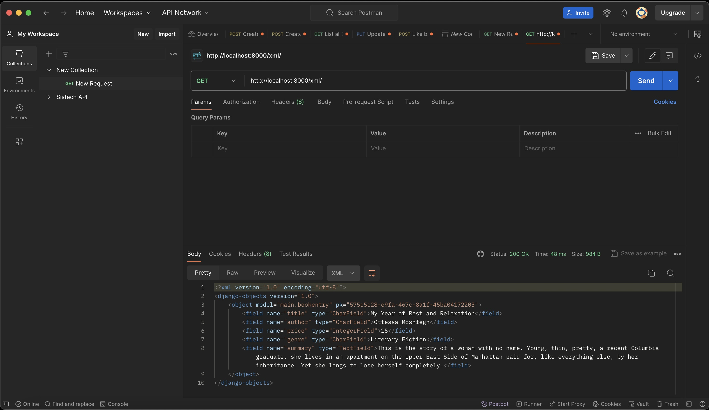
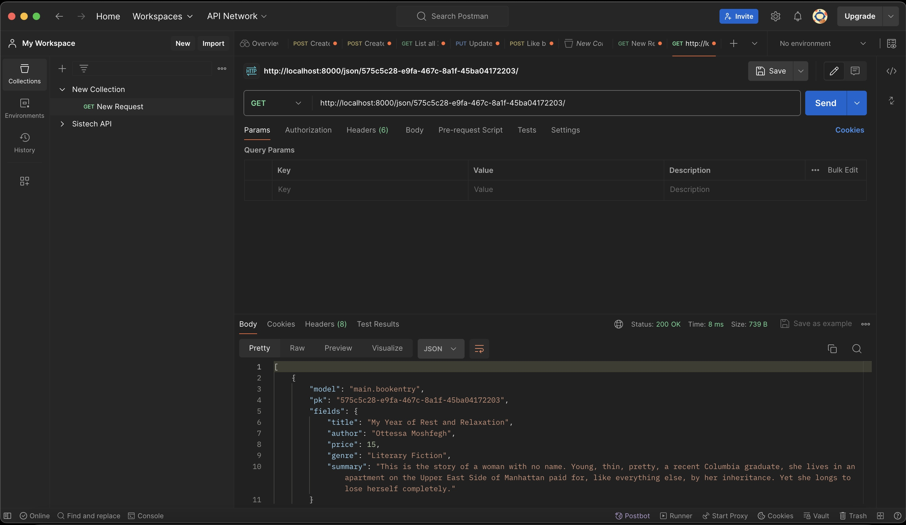

# Welcome to Dog Eared Books!
Link to PWS deployement: [Dog Eared Books](http://athazahra-nabila-dogearedbooks.pbp.cs.ui.ac.id/)  
By Athazahra Nabila Ruby - 2306173113

<details>
<Summary><b>Assignment 2</b></summary>
## Step-by-Step Project Implementation
A breakdown of what I did to execute this project:
### Creating the Django project
1. I made a new directory "dog-eared-books" to store the contents of this project
2. I installed a virtual inviroment in the "book_store" directory by running this command on the terminal:
    ```
   python3 -m venv env
   ```
3. Then I activated it with the command:
    ```
   source env/bin/activate
   ```
4. I created the file "requirement.txt" and edited it by using VS Code to add the required the dependencies:
   ```
   django
   gunicorn
   whitenoise
   psycopg2-binary
   requests
   urllib3
   ```
5. Then I installed the dependencies with the command:
    ```
    pip install -r requirements.txt
    ```
6. I created a new Django project named "book_store" with the command 
    ```
    django-admin startproject book_store .
    ```
7. After the project was installed, I added "localhost" and "127.0.0.1" to the ALLOWED_HOSTS in the settings.py file.

### Creating an application with the name main in the project.
8. I created a new application named main with the command:
    ```
    python manage.py startapp main
    ```
9. After the main application was installed, I added 'main' to the INSTALLED_APPS list in the settings.py file to signify the presence of the main application.

### Creating a Template
10. To create a template, I created a templates directory (within the main directory) and added a main.html file that would serve as the template.
11. I filled the template with the necessary components (application name, name, class)

### Creating Models
12. I added a model in the models.py file called Product, which has the necessary attributes name, price, and description, and i also added other attributes that relate to my shop, namely release_date and genre.
13. I then performed migrations to apply my model with the commands:
    ```
    python3 manage.py makemigrations
    python3 manage.py migrate
    ```

### Connecting View with Template
14. I filled the views.py file with a function called show_main that will "send" data to the template if a request is made from the template, which includes app_name, name, and class.

### Configuring URLs
15. I created a urls.py file in the main application and added the following code to configure the routing in the application:
    ```
    from django.urls import path
    from main.views import show_main

    app_name = 'main'

    urlpatterns = [
        path('', show_main, name='show_main'),
    ]
    ```
16. Then, I edited the urls.py in the book_store project for overall project with:
    ```
    from django.urls import path, include

    urlpatterns = [
        path('', include('main.urls')),
    ]
    ```

### Git and PWS Deployment
17. I created a new repository on GitHub and connected it to the local repository by runnning git init.
18. After the connection was established, I performed add, commit, and push actions to the remote GitHub repository.
19. To deploy to PWS, I created a new project titled 'dogearedbooks' on the PWS website then added my PWS deployement URL to the ALLOWED_HOSTS list in settings.py.
20. Finally, I connected the repository to PWS and pushed it to the PWS repository for deployment.
21. I'm finished!


## Diagram


## The use of git in software development
Git is a version control system that helps developers track changes in their codebase, making it easier to manage and collaborate on projects. It allows multiple developers to work on the same project simultaneously, supports branching and merging, and provides a history of all changes, enabling easy rollback to previous versions if needed.


## Why Django?
I believe that one of the reasons Django was chosen is because it uses Python, a language we have been studying since the first semester. This allows students to focus directly on platform-based programming concepts without having to learn a new syntax, as they are already familiar with Python.

## Why are Django Models Called ORMs?
Django models are called ORMs (Object Relational Mapping) because of their nature of directly converting data into tables. As a result, developers don't need to interact directly with data tables like in SQL but can create and access data directly from the model.

</details>

<details>
<Summary><b>Assignment 3</b></summary>

## Step-by-Step Project Implementation

### Setting up template
1. Firstly, I created a new templates folder in the root directory and added base.html that functions as a base view to ensure a consistent design throughout the website and minimize code duplication.
2. To adjust to the changes, I added BASE_DIR / 'templates' in settings.py to the DjangoTemplates DIR field.
3. Then I adjusted my main.html file to use base.html as the main template.

### Creating an input form
4. First, I added an UUID to correctly identify each book and did a model migration.
```
class BookEntry(modelsModel):
    ...
   id = models.UUIDField(primary_key = True, default=uuid.uuid4, editable=False)
   ...
``` 
5. Then, I created the file forms.py which is used to create the structure of the form that can accept entries or new item data. It contains:
```
from django.forms import ModelForm
from main.models import BookEntry

class BookEntryForm(ModelForm):
    class Meta:
        model = BookEntry
        fields = ["title", "author", "price", "genre", "summary"]
```
6. On views.py, I imported redirect and created a new function which implemented the form and validates the inputs.
```
def create_book_entry(request):
    form = BookEntryForm(request.POST or None)

    if form.is_valid() and request.method == "POST":
        form.save()
        return redirect('main:show_main')

    context = {'form': form}
    return render(request, "create_book_entry.html", context)
```
7. I modified the show_main function so that it stores all of the entries.
```
def show_main(request):
    book_entries = BookEntry.objects.all()

    context = {
        'application_name': 'dog-eared-books',
        'class': 'PBP KKI',
        'name': 'Athazahra Nabila Ruby',
        'book_entries': book_entries
    }

    return render(request, "main.html", context)
```
8. I then imported the create_book_entry function to urls.py and implemented its URL routing by adding:
```
urlpatterns = [
   ...
   path('create-book-entry', create_book_entry, name='create_book_entry')
]
```
9. I created create_book_entry.html to add a HTML page on submitting the entries, it contains:
```
 

<h1>Add New Book Entry</h1>

<form method="POST">
  
  <table>
    {{ form.as_table }}
    <tr>
      <td></td>
      <td>
        <input type="submit" value="Add Book Entry" />
      </td>
    </tr>
  </table>
</form>


```
10. Then I modified my main.html to add a button that redirects to the entry submission and displays said entries as a table:
```
...

<p>Sorry, there are no books available!</p>

<table>
  <tr>
    <th>Title</th>
    <th>Author</th>
    <th>Price</th>
    <th>Genre</th>
    <th>Summary</th>
  </tr>

   This is how to display book data
   
  
  <tr>
    <td>{{book_entry.title}}</td>
    <td>{{book_entry.author}}</td>
    <td>{{book_entry.price}}</td>
    <td>{{book_entry.genre}}</td>
    <td>{{book_entry.summary}}</td>
  </tr>
  
</table>


<br />

<a href="">
  <button>Add New book Entry</button>
</a>

```

### Adding views
11. I added 4 functions to views.py to access data in the form of XML, JSON, and both by IDs
```
def show_xml(request):
    data = BookEntry.objects.all()
    return HttpResponse(serializers.serialize("xml", data), content_type="application/xml")

def show_json(request):
    data = BookEntry.objects.all()
    return HttpResponse(serializers.serialize("json", data), content_type="application/json")

def show_xml_by_id(request, id):
    data = BookEntry.objects.filter(pk=id)
    return HttpResponse(serializers.serialize("xml", data), content_type="application/xml")

def show_json_by_id(request, id):
    data = BookEntry.objects.filter(pk=id)
    return HttpResponse(serializers.serialize("json", data), content_type="application/json")
```

### Creating URL routing to each view
12. I then imported those 4 functions to urls.py then implemented their URL routing by adding:
```
urlpatterns = [
    ...
    path('xml/', show_xml, name='show_xml'),
    path('json/', show_json, name='show_json'),
    path('xml/<str:id>/', show_xml_by_id, name='show_xml_by_id'),
    path('json/<str:id>/', show_json_by_id, name='show_json_by_id'),
]
```
13. Lastly, I deployed the changes I made to PWS and Github.
14. I'm done!

## Why do we need data delivery in implementing a platform?
In the process of implementing a platform, data delivery is important because it facilitates communication between clients, servers, and other systems. This process ensures that information can be sent quickly, securely, and efficiently. Without proper data delivery, the platform would feel slow and inefficient, which could reduce user interest.

## Which is better, XML or JSON? Why is JSON more popular than XML?
In my opinion, JSON is better and more popular than XML because JSON has a simpler structure and appearance, making it easier for humans to read. Moreover, JSON processing tends to be faster and more efficient for data exchange due to its lower complexity compared to XML.

## What is the usage of is_valid() in Django forms? Why do we need the method in forms?
The is_valid() method in Django forms is used to check the validity of the data entered. If the data entered meets the form's requirements (such as data type, data length), then is_valid() will return True, otherwise, it will return False. This method is needed because it verifies and ensures that the data to be entered into the database is correct. Additionally, this method simplifies management in case there are errors when the entered data is not valid.

## Why do we need csrf_token when creating a form in Django? What could happen if we did not use csrf_token on a Django form? How could this be leveraged by an attacker?
The csrf_token is important to protect web applications from Cross-Site Request Forgery (CSRF) attacks, where an attacker can trick an authenticated user into sending malicious requests to the server without their knowledge. Without a csrf_token, the server cannot differentiate between a legitimate request and a malicious one, allowing attackers to abuse the user’s session to perform unintended actions. Therefore, the csrf_token ensures that every request originates from a legitimate and secure source.

## Postaman Screenshots
URL XML


URL XML by ID


URL JSON


URL JSON by ID


</details>